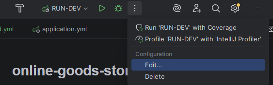
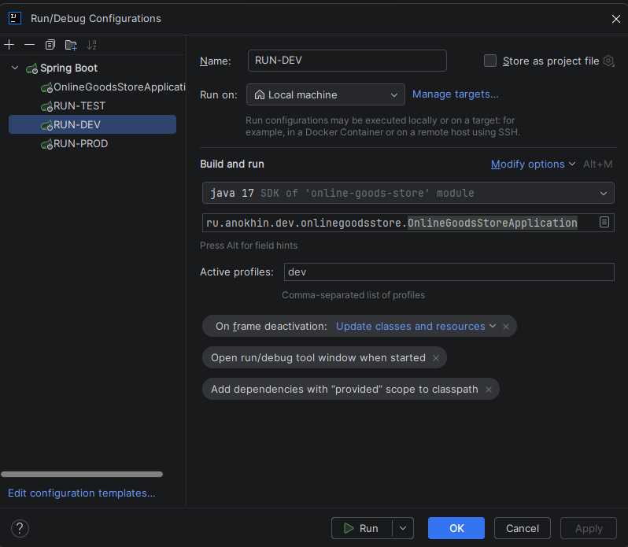

# online-goods-store

## Разные профили для запуска приложения
* Test
* Dev
* Prod

  Необходимо зайти в настройки запуска проекта (edit configuration)

и создать три разных профиля. В каждом из профилей указать в поле "Active profiles" суффикс соответствующего application-<суффикс>.yml файла для каждого профиля

тестовый пуш311111123123123123123123123123123121233123